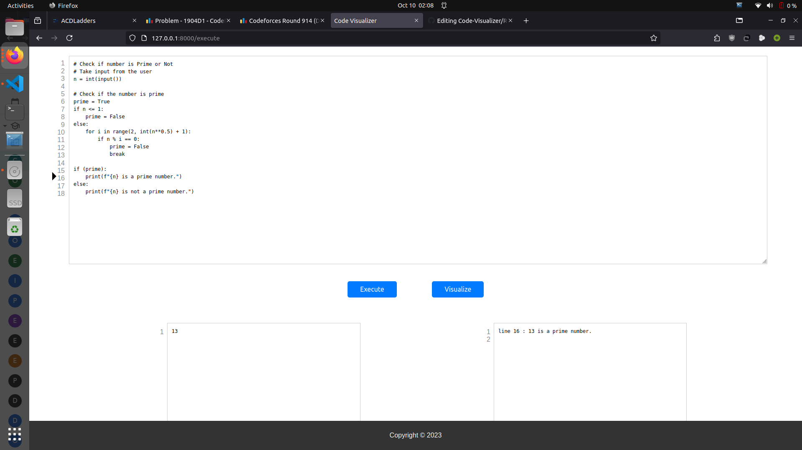

## Code Visualizer:
- Code Visualizer which visualizes your python code runtime flow and can also be used as online compiler

## Requirements:
- Python 3.8
- Other dependencies in `requirement.txt'
- Linux Operating System

## Steps to Setup Locally:
- Install `virtualenv` for dependency management
    ```
    pip install virtualenv
    ```
- Create and Activate virtual environment
    ```
    virtualenv env
    ```
- Activate the new virtual environment
    ```
    source env/bin/activate
    ```   
- Install Dependencies
    ```
    pip install -r requirements.txt
    ```
- Make database migrations
    ```
    python3 manage.py makemigrations
    python3 manage.py migrate
    ```
- Run development server on localhost
    ```
    python3 manage.py runserver 0.0.0.0:8000
    ```

## Demonstration Screenshots

<p align="center">
  
</p>

<p align="center">
  
</p>
